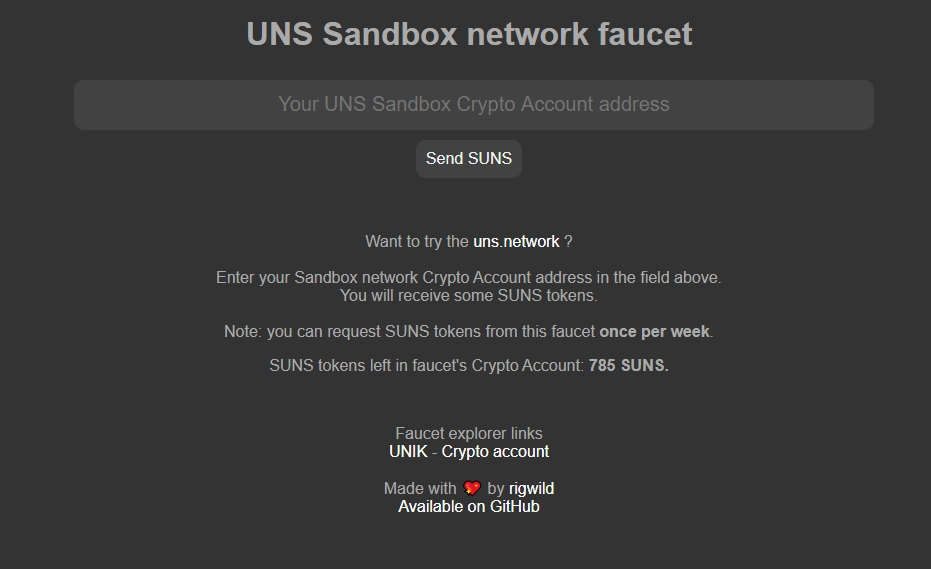

# UNS Faucet
A faucet to gift SUNS tokens to [uns.network](https://www.uns.network/) users 🤑💸.

## Install
```sh
git clone https://github.com/rigwild/uns-faucet
cd uns-faucet
yarn
```

## Build
You need [Parcel bundler](https://github.com/parcel-bundler/parcel) to build the project.
```sh
yarn global add parcel-bundler
```

You can then build it.
```sh
yarn build
```

## Configuration
Copy [`.env.example`](`.env.example`) to `.env`.

| Variable | Description | Example |
| -------- | ----------- | ------- |
| `SERVER_PORT` | HTTP port the server will listen | `8080` |
| `GIFT_INTERVAL_DELAY_MS` | Delay a user must wait before asking for another gift | `604800000` |
| `GIFT_AMOUNT` | Gift amount in satosuns | `'3500000000'` (35 SUNS) |
| `GIFT_FEE` | Gift amount in satosuns | `'10000000'` (0.1 SUNS) |
| `GIFT_VENDORFIELD` | Message set in the Smartbridge field | `'Faucet money 🤑💸'` |
| `NETWORK` | The [uns.network](https://www.uns.network/) to operate on | `'sandbox'` |
| `PASSPHRASE` | Wallet passphrase | `'suns faucet wallet main passphrase'` |
| `SECOND_PASSPHRASE` | Second wallet passphrase | `'suns faucet wallet second passphrase'` |

## Start
```sh
yarn start
```

## Screenshot


## License
[The MIT License](./LICENSE).
